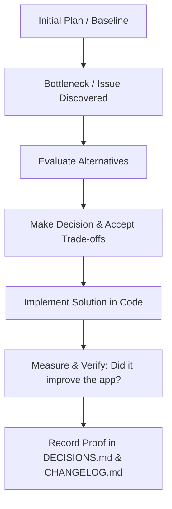

## Core Execution Directives

Assign the following constraint block to the agent's system prompt to enforce strict output boundaries, prevent scope creep, and trigger internal logic verification:

```text
Provide concise, actionable outputs without conversational fluff. Make zero assumptions, introduce no out-of-scope changes, and strictly avoid over-engineering. Retain all critical technical details in your solution. Briefly outline your reasoning to verify accuracy before providing the final answer.
```

<!-- code-review-graph MCP tools -->

## MCP Tools: code-review-graph

**IMPORTANT: This project has a knowledge graph. ALWAYS use the
code-review-graph MCP tools BEFORE using Grep/Glob/Read to explore
the codebase.** The graph is faster, cheaper (fewer tokens), and gives
you structural context (callers, dependents, test coverage) that file
scanning cannot.

### When to use graph tools FIRST

- **Exploring code**: `semantic_search_nodes_tool` or `query_graph_tool` instead of Grep
- **Understanding impact**: `get_impact_radius_tool` instead of manually tracing imports
- **Code review**: `detect_changes_tool` + `get_review_context_tool` instead of reading entire files
- **Finding relationships**: `query_graph_tool` with callers_of/callees_of/imports_of/tests_for
- **Architecture questions**: `get_architecture_overview_tool` + `list_communities_tool`

Fall back to Grep/Glob/Read **only** when the graph doesn't cover what you need.

### Key Tools

| Tool                             | Use when                                               |
| -------------------------------- | ------------------------------------------------------ |
| `detect_changes_tool`            | Reviewing code changes — gives risk-scored analysis    |
| `get_review_context_tool`        | Need source snippets for review — token-efficient      |
| `get_impact_radius_tool`         | Understanding blast radius of a change                 |
| `get_affected_flows_tool`        | Finding which execution paths are impacted             |
| `query_graph_tool`               | Tracing callers, callees, imports, tests, dependencies |
| `semantic_search_nodes_tool`     | Finding functions/classes by name or keyword           |
| `get_architecture_overview_tool` | Understanding high-level codebase structure            |
| `refactor_tool`                  | Planning renames, finding dead code                    |

### Workflow

1. The graph auto-updates on file changes (via hooks).
2. Use `detect_changes_tool` for code review.
3. Use `get_affected_flows_tool` to understand impact.
4. Use `query_graph_tool` pattern="tests_for" to check coverage.

---

### Mandatory Implementation Steps for New Features:

1. **Declare in Shared Types (`packages/types/src/featureFlags.ts`)**:
    - Add the new flag key constant to `FEATURE_FLAGS` (e.g. `NEW_FEATURE: 'feature_new_feature'`).
    - Add its type definition and set its baseline default value to `false` in `TIER_FEATURE_DEFAULTS.free` (and other tiers as appropriate).
2. **Backend Route Protection (`apps/api`)**:
    - Guard all associated REST routes or actions using the `requireFeature(FEATURE_FLAGS.<NAME>)` pre-handler middleware (`apps/api/src/middleware/featureGuard.ts`).
    - If disabled, the API must return `403 Forbidden` (`FEATURE_DISABLED`).
3. **Frontend UI Gating (`apps/web` & `apps/extension`)**:
    - Wrap all related UI controls, action buttons, modals, or pages in `<FeatureGate flag={FEATURE_FLAGS.<NAME>}>` or evaluate with `useFeatureFlag(FEATURE_FLAGS.<NAME>)`.
4. **Superadmin Metadata**:
    - Register the new flag's label and description in `AdminFeatureFlags.tsx` so root administrators can toggle and override it for any tenant or in bulk.
5. **Zero Ungated Features**:
    - No agent may merge, commit, or deliver a new feature without verifying feature flag protection and default `false` state.

---

# Project Work Protocol: High-Signal Living Documentation System

_(Optimized for Fullstack JavaScript / TypeScript Development)_

## Purpose

This repository operates on a **living project-memory and documentation framework**.

The primary objective is to maintain an unbroken, auditable chain of causality:

1. **Where we started**: The baseline origin, initial architecture, PRD requirements, and data models.
2. **Why plans changed**: The concrete triggers, bottlenecks, and alternatives evaluated when a technical pivot occurred.
3. **Proof of improvement**: Verifiable evidence, benchmarks, or test results proving that the pivot made the application better.

This protocol applies to **every agent, human developer, and work session** across all disciplines (frontend, backend, database migrations, API design, performance tuning, and refactoring).

> [!IMPORTANT]
> **Documentation is part of the definition of done.**
> The codebase is the physical source of truth, but the `docs/` system is the long-term memory that explains _why_ the codebase is in its current state.

---

# 1. The 4-File Documentation Architecture

Rather than fragmenting project memory across a dozen overlapping files, all project knowledge is organized into **4 high-signal files** inside `docs/`, governed by the root agent rules.

```
project-root/
├── AGENTS.md                 # Operating rules, definition of done, & start/end protocols
└── docs/
    ├── CHARTER.md            # WHERE WE STARTED: PRD, baseline architecture, initial database models
    ├── STATUS.md             # WHERE WE ARE: Current phase, active tasks, blockers, handoff notes
    ├── DECISIONS.md          # WHY WE PIVOTED: Impact-Loop ADRs (Problem -> Decision -> Proof of Impact)
    └── CHANGELOG.md          # WHAT CHANGED: Chronological release history with verified outcomes
```

## Source of Truth Mapping

| Document                | Primary Responsibility                               | When to Read                                | When to Update                                        |
| :---------------------- | :--------------------------------------------------- | :------------------------------------------ | :---------------------------------------------------- |
| **`AGENTS.md`**         | Agent operating rules & quality gates                | At the start of every session               | When engineering protocols change                     |
| **`docs/CHARTER.md`**   | Baseline PRD, initial architecture, Prisma/DB schema | When onboarding or checking scope limits    | Never rewrite; only append scope amendments           |
| **`docs/STATUS.md`**    | Active sprint, immediate tasks, handoff context      | Before starting any work                    | At the end of every session or task completion        |
| **`docs/DECISIONS.md`** | Architectural decisions, plan pivots, impact proof   | When designing features or hitting blockers | Whenever a plan changes or a technical choice is made |
| **`docs/CHANGELOG.md`** | Chronological log of shipped work & lessons          | When reviewing recent history               | When meaningful features, fixes, or refactors land    |

---

## 2. Inlining vs. Scale-Out Rule (PRD, Architecture & Database Schema)

To avoid context fragmentation and unnecessary token consumption:

1. **Default (Inline First)**:
    - **PRD (Product Requirements)** $\rightarrow$ Resides in `docs/CHARTER.md §2`.
    - **System Architecture** $\rightarrow$ Resides in `docs/CHARTER.md §3`.
    - **Database & Data Models** $\rightarrow$ Resides in `docs/CHARTER.md §4`.
2. **Scale-Out Threshold (When to Extract)**:
    - If the database schema exceeds **10+ Prisma models/tables** or requires extensive migration notes $\rightarrow$ extract to `docs/DATABASE_SCHEMA.md` and link it from `CHARTER.md`.
    - If architecture spans **microservices, background workers, or event queues** $\rightarrow$ extract to `docs/ARCHITECTURE.md`.
    - If product requirements exceed **5+ pages of user flows and compliance** $\rightarrow$ extract to `docs/PRD.md`.

---

# 2. Mandatory Start-of-Work Protocol

Before executing any code changes or proposing architectural shifts, every agent MUST:

1. **Read `AGENTS.md`** to load the operational rules and quality gates.
2. **Inspect `docs/STATUS.md`** to understand the active milestone, current blockers, and last handoff context.
3. **Reference `docs/CHARTER.md`** if the task touches core data models, API contracts, or baseline requirements.
4. **Inspect the actual repository state**:
    - Check `package.json`, TypeScript definitions, Prisma/ORM schemas, and test suites.
    - Ground truth is in the code, not in outdated verbal summaries.
5. **Formulate the plan**: Verify whether the proposed task adheres to current decisions or requires a documented pivot in `docs/DECISIONS.md`.

---

# 3. Decision & Plan-Change Protocol (The Impact-Loop)

Whenever a technical assumption fails, a performance bottleneck is discovered (e.g. high p99 latency, React re-render cascades, ORM N+1 queries), or a requirement pivots, the agent MUST record an entry in `docs/DECISIONS.md` using the **Impact-Loop Schema**.



### Required Decision Entry Schema

Every entry in `docs/DECISIONS.md` MUST include the following 6 sections:

```markdown
## [DEC-XXX] Title of Decision / Plan Change

- **Date:** YYYY-MM-DD
- **Status:** Proposed | Accepted | Validated | Superseded
- **Related Task / Baseline:** Reference to CHARTER.md or STATUS.md

### 1. Problem / Trigger (Why the Original Plan Changed)

Describe the exact failure, bottleneck, unexpected behavior, or new requirement that made the previous approach unviable (e.g., ORM N+1 query stalling endpoint, client bundle too large).

### 2. Alternatives Evaluated

- **Option A:** Summary, pros, cons, and reasons for rejection.
- **Option B:** Summary, pros, cons, and reasons for rejection.

### 3. Decision & Trade-offs

State the selected approach and the explicit trade-offs accepted (e.g., added dependency, extra build complexity, migration cost).

### 4. Implementation Details

Key files modified, new npm packages added, or database migrations executed.

### 5. Proof of Improvement (Evidence & Metrics)

Concrete, verifiable proof showing that the change improved the application:

- **Quantitative Metrics:** (e.g., Endpoint latency reduced from 850ms to 42ms; bundle size reduced by 60KB; memory usage reduced by 40%).
- **Verification Commands / Tests:** Exact automated test (`npm test`, `vitest`, `playwright`) or benchmark script validating the fix.

### 6. Lessons & Downstream Impact

What was learned that future developers/agents must know to prevent repeating the original mistake.
```

---

# 4. Mandatory End-of-Work Protocol

At the conclusion of any meaningful work session, the agent MUST execute this checklist:

- [ ] **Verify against Code**: Run `npm test`, typecheck (`tsc --noEmit`), or execute targeted benchmarks.
- [ ] **Sync `docs/STATUS.md`**: Update current phase progress, mark finished items, and write a fresh handoff summary.
- [ ] **Record Pivots in `docs/DECISIONS.md`**: If any design or architectural pivot occurred, ensure the Impact-Loop record is fully populated with proof of improvement.
- [ ] **Log in `docs/CHANGELOG.md`**: Append a dated summary of changes made and verifiable results.
- [ ] **Generate Completion Report**: Provide a concise summary in chat highlighting what changed, what was verified, and the recommended next step.

---

# 5. Core Rules of Truth & Traceability

### A. Never Claim Unverified Progress

Documentation MUST reflect verified reality. Never label a task as `Complete` or `Working` without verifiable evidence.

Use unambiguous status states:

- `Planned` — Specified in Charter/Status, no code written yet.
- `In Progress` — Active development underway.
- `Implemented (Unverified)` — Code written, but tests or validation not yet executed.
- `Validated` — Code tested with passing automated tests (`vitest`, `playwright`) or demonstrable evidence.
- `Blocked` — Stopped due to external dependency or unaddressed problem.
- `Superseded` — Replaced by a newer decision (`DEC-XXX`).

### B. Stable Identifiers

Use structured IDs to link problems, decisions, and commits across files:

- `DEC-001`, `DEC-002`: Architectural decisions and plan pivots.
- `TASK-001`, `TASK-002`: Discrete implementation tasks in `STATUS.md`.
- `BENCH-001`: Performance benchmarks and experiment results.

---

# 6. Ready-to-Use File Templates

Copy and paste these templates directly when initializing a new JavaScript/TypeScript fullstack project.

---

### Template 1: Root `AGENTS.md`

```markdown
# Agent Working Protocol

## 1. Documentation Architecture

This project uses a 4-file documentation memory system in `docs/`:

- `docs/CHARTER.md`: Baseline PRD, initial fullstack architecture, Prisma/DB schemas.
- `docs/STATUS.md`: Living state, active tasks, blockers, handoff notes.
- `docs/DECISIONS.md`: Plan pivots & ADRs with full proof-of-improvement loops.
- `docs/CHANGELOG.md`: Chronological release log with verified outcomes.

## 2. Start-of-Work Checklist

1. Read `AGENTS.md` and `docs/STATUS.md`.
2. Review `docs/CHARTER.md` if working on core data models or architecture.
3. Inspect `package.json`, schema definitions, and actual codebase (code is ground truth).

## 3. Plan-Change Rule

Never silently alter plans. If an approach fails or needs a pivot:

- Document the trigger, alternatives, decision, and proof of improvement in `docs/DECISIONS.md`.

## 4. Definition of Done

A task is complete ONLY when:

1. Implementation is verified (`npm test`, `npx tsc --noEmit`, or validation tests).
2. `docs/STATUS.md` reflects current task state and next handoff.
3. Any architectural decisions are logged in `docs/DECISIONS.md`.
4. Shipped work is recorded in `docs/CHANGELOG.md`.
```

---

### Template 2: `docs/CHARTER.md`

```markdown
# Project Charter & Baseline Specifications

## 1. Project Overview & Origin

- **Project Name:** [Project Name]
- **Created Date:** YYYY-MM-DD
- **Target Audience:** [Target users]
- **Core Value Proposition:** [Primary problem this project solves]

## 2. Product Requirements (PRD)

- **Core Feature 1:** [User flow & acceptance criteria]
- **Core Feature 2:** [User flow & acceptance criteria]
- **Non-Goals (Out of Scope):** [Explicit list of features we will NOT build initially]

## 3. Starting Architecture & Tech Stack

- **Frontend / Client:** React / Next.js / Vite / Tailwind CSS / Vanilla CSS
- **Backend / API:** Node.js / Fastify / Hono / Express / Next.js Server Actions / tRPC
- **Data Persistence & ORM:** PostgreSQL / SQLite / Redis / Prisma / Drizzle ORM
- **Validation & Types:** TypeScript (Strict), Zod / Valibot
- **Runtime & Tooling:** Node.js / Bun / pnpm / Docker

## 4. Database Schema & Core Models (Prisma / SQL)

| Model / Table | Key Fields                                 | Relationships / Notes            |
| :------------ | :----------------------------------------- | :------------------------------- |
| `User`        | `id` (CUID/UUID), `email` (Unique), `role` | Has many `Projects`              |
| `Project`     | `id`, `title`, `userId` (FK -> User.id)    | Belongs to `User`                |
| `Task`        | `id`, `projectId` (FK), `status` (Enum)    | Indexed on `(projectId, status)` |

## 5. Invariant Constraints & Standards

- Strict TypeScript types across all API contracts and data models (no `any`).
- p95 API response time under 100ms for core endpoints.
```

---

### Template 3: `docs/STATUS.md`

```markdown
# Project Status & Handoff

**Last Updated:** YYYY-MM-DD HH:MM (Timezone)  
**Current Phase:** [Phase 1: Foundation / Phase 2: Core Features / Phase 3: Hardening]

## Active Tasks

- [ ] `TASK-003`: [Description of current task in progress]
- [x] `TASK-002`: [Description of completed task]
- [x] `TASK-001`: [Description of completed task]

## Current Blockers & Risks

- **Blocker:** [None / Description of blocking issue]
- **Risk:** [Potential dependency issue or performance concern]

## Session Handoff Notes (For Next Agent / Session)

- **Current Objective:** [What was being worked on]
- **Files Modified in Last Session:**
    - `src/routes/items.ts` — [Added pagination with Zod query validation]
- **Recommended Next Action:** [Immediate first step for the incoming agent]
```

---

### Template 4: `docs/DECISIONS.md`

```markdown
# Decision Log & Plan Pivots (ADR)

This file tracks every architectural decision, pivot away from original plans, and concrete proof that the change improved the application.

---

## [DEC-001] Selection of Fastify + Prisma + Zod for Core API

- **Date:** YYYY-MM-DD
- **Status:** Validated
- **Related Task / Baseline:** CHARTER.md §3

### 1. Problem / Trigger

Need high-throughput REST API layer with end-to-end type safety from database models to HTTP serialization.

### 2. Alternatives Evaluated

- **Option A (Express + Mongoose):** Familiar but lacks native schema validation performance and type generation.
- **Option B (Fastify + Prisma + Zod):** High throughput, automated OpenAPI generation, and strictly typed ORM queries.

### 3. Decision & Trade-offs

Selected **Option B**. Accepted trade-off: Prisma query engine binary overhead in container environments.

### 4. Implementation Details

Configured Fastify server with `@fastify/swagger` and Prisma client singleton in `src/lib/db.ts`.

### 5. Proof of Improvement (Evidence & Metrics)

- Route schema validation throughput: ~22,000 req/sec in benchmark test (`npm run bench`).
- Type safety verified with `npx tsc --noEmit` passing with 0 errors.

### 6. Lessons & Downstream Impact

Always wrap Prisma queries with connection pooling handlers in serverless/container restarts.
```

---

### Template 5: `docs/CHANGELOG.md`

```markdown
# Project Changelog & Verified Outcomes

All notable changes, bug fixes, and verifiable improvements to this project are documented chronologically in this file.

---

## [Unreleased]

### Added

- User authentication routes with JWT verification (`TASK-002`).

### Fixed

- Fixed N+1 query issue on dashboard project listing (`DEC-002`).

---

## [0.1.0] - YYYY-MM-DD

### Added

- Initial fullstack project scaffolding (`CHARTER.md`).
- Established Prisma database schema and migration scripts.

### Verified Impact

- Automated test suite operational with Vitest (100% pass rate).
- TypeScript strict typecheck clean (`npx tsc --noEmit`).
- Baseline API health endpoint latency: 12ms.
```
