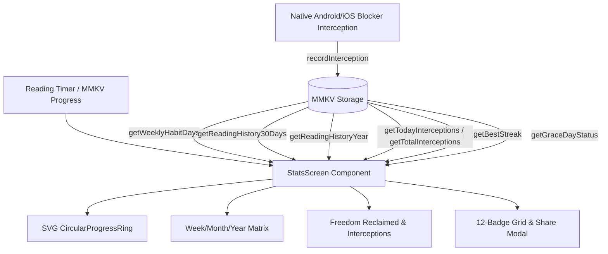

# Design Specification: Stats Page & Spiritual Freedom Dashboard Overhaul

- **Date:** 2026-09-28
- **Topic:** Stats Page Overhaul, Interception Telemetry, Behavioral Psychology & Tiered Progression
- **Status:** Approved for Implementation Planning (Reviewed with Marketing Council & Behavioral Psychology)

---

## 1. Executive Summary & Problem Trigger

### Problem
The current Stats page (`src/app/stats-detail.tsx`) exhibits several UX, psychological, and technical flaws:
1. **Misleading Telemetry:** The weekly 7-day habit tracker computes past days using a placeholder expression (`timer.streak > 0 ? 1 : 0`) rather than reading authentic per-day progress from MMKV `getWeeklyHabitDays()`.
2. **Static Non-Progress Gauge:** The circular progress indicator in the hero card is a static border rather than an authentic progress arc displaying real percentage toward the daily goal.
3. **Transient Best Streak:** Best streak defaults to `Math.max(timer.streak, 1)`, meaning if a user breaks a 30-day streak, their past achievement is immediately lost and displayed as their current streak.
4. **Duplicate Content:** A full `DailyDevotionalCard` is rendered in the middle of the analytics dashboard, duplicating the Home screen and cluttering telemetry views.
5. **Fabricated Metrics:** The "Our Week in Review" card displays hardcoded metrics (`145.9M Verses Read`, `434.1M minutes`), violating the zero-fabricated-data standard established in `DEC-031` and eroding user trust.
6. **Missing Distraction Telemetry:** The app's core value proposition—shielding users from distracting apps so they can spend time with God—has zero interception reporting on the stats screen.

### Goals
- Deliver an authentic, high-converting, spiritually uplifting analytics dashboard.
- Display genuine progress rings with dynamic states, accurate 7-day/30-day/12-month telemetry, and persistent historical best streaks.
- Quantify freedom reclaimed through distraction interception tracking and time redeemed from doomscrolling.
- Expand spiritual achievement progression to 12 meaningful spiritual tiers with an anti-alienation compact display hierarchy.
- Reframe app blocking into spiritual liberation using behavioral psychology (Goal-Gradient Effect, Loss Aversion, and Endowment Effect).
- Maintain 100% offline-first speed and zero runtime overhead.

---

## 2. Architectural Decisions & Scope

### A. Deprecations and Removals
- **Remove `DailyDevotionalCard` from `stats-detail.tsx`:** Keep devotionals on Home and Reader tabs where reading and contemplation occur.
- **Remove Hardcoded Community Numbers:** Purge the static `145.9M` / `434.1M` section. Replace it with an authentic personal "Freedom Reclaimed" telemetry card.

### B. Core Telemetry & Data Layer Additions (`src/lib/mmkv.ts`)
1. **All-Time Best Streak:**
   - Key: `all_time_best_streak` (`STORAGE_KEYS.ALL_TIME_BEST_STREAK`).
   - Getter/Setter: `getBestStreak(): number`, `updateBestStreak(currentStreak: number): void`.
   - Update rule: Evaluated on timer progress, streak recalculation, and stats load: `if (current > best) best = current`.
2. **Distraction Interception Tracking:**
   - Keys:
     - `interception_counts_${dateKey}`: Daily count of app blocker redirects to Scripture.
     - `total_interceptions_count`: Cumulative lifetime interceptions.
   - Helper functions:
     - `recordInterception(): void` (increments today + lifetime).
     - `getTodayInterceptions(): number`.
     - `getTotalInterceptions(): number`.
     - `getScreenTimeRedeemedHours(): number` (Calculates redeemed hours based on intercepted doomscroll sessions and Scripture reading minutes).
3. **Weekly Habit Days Integration:**
   - Utilize existing `getWeeklyHabitDays(): HabitDay[]` in `stats-detail.tsx`.
   - Ensure accurate mapping of daily minutes (`minutesRead`), completion indicators (`completed`), and today markers (`isToday`).
4. **Grace Day Indicator:**
   - Read `getGraceDayStatus()` from `src/lib/mmkv.ts` to surface whether the user's monthly streak grace protection is Active, Available, or Used.

---

## 3. UI/UX Component Specifications

### A. Hero Card: Read Today & SVG Circular Progress Ring
- **Component:** `CircularProgressRing` (using `react-native-svg` with `Svg`, `Circle`, `G`).
  - Size: 96x96dp, Stroke Width: 8dp.
  - Track: `colors.surfaceSubtle` background track.
  - Dynamic Goal-Gradient Visual States:
    - **In-Progress:** Radiant Gold stroke (`colors.accent`) filling smoothly with `strokeDashoffset`.
    - **Completed (100%+):** Celebratory Emerald Green (`colors.success`) with checkmark icon (`Check`) and active glow.
  - Center Content: Live percentage (`53%`) or `Flame` / `Check` icon when 100% met.
- **Metrics Display:**
  - "Read Today": `${minutesToday} min / ${timer.goalMinutes} min`
  - "Current Streak": `${timer.streak} ${timer.streak === 1 ? 'day' : 'days'}`
  - Status Subtitle: "Goal Met 🎉" or "${remaining} min left to unshield apps"

### B. Habit Matrix: Week / Month / Year
- **Week Tab:**
  - 7 columns corresponding to Sun–Sat.
  - Renders true `minutesRead` from `getWeeklyHabitDays()`.
  - Checkmark badge when `completed === true`.
  - Active underline indicator on today's day column.
- **Month Tab (30-Day Calendar Heatmap):**
  - Retain 30-day heatmap grid with day inspection banner and telemetry summary (Total Time, Goal Met, Daily Avg).
- **Year Tab (12-Month Telemetry Pillar Chart):**
  - Retain 12-month pillar tracks, target baseline, active month inspection card, and Q1–Q4 seasonal matrix.

### C. Freedom Reclaimed (App Shielding & Interceptions)
- **Title:** "Freedom Reclaimed" (with `ShieldCheck` icon).
- **Subtext:** "Mindless distractions transformed into quiet time with God."
- **Three-Metric Row:**
  1. **Temptations Overcome:** `${todayInterceptions} today` (Subtext: `${totalInterceptions} all-time`).
  2. **Screen Time Redeemed:** `${redeemedHours}h saved` from social media loops.
  3. **Shield Status:** `${blockedAppsCount} apps protected` with status pill ("Active & Guarded").
- **App Badges Row:** Compact horizontal chip row showing authentic SVG icons (`Instagram`, `TikTok`, `YouTube`, `X`, `Reddit`) of currently shielded applications.

### D. Spiritual Milestones & Lifetime Impact
- **Three-Card Summary Grid:**
  1. **Verses Read:** Formatted estimate based on actual sessions and reading minutes.
  2. **Total Time in Scripture:** Formatted hours and minutes (e.g. `2h 15m`).
  3. **All-Time Best Streak:** Persistent record (`${bestStreak}d`).
- **Milestone Progress Track:**
  - Dynamic target: 3d → 7d → 14d → 30d → 50d → 100d.
  - Animated horizontal progress bar with percentage to next spiritual milestone.
- **Grace Shield Banner (Loss-Aversion Framing):**
  - For Sanctuary members:  
    `"🛡️ Streak Grace Shield Active — 1 Missed Day Protected this Month. Your daily walk with God is preserved."`
  - For Covenant (Free) members:  
    `"🛡️ Protect Your Walk: Sanctuary includes monthly Streak Grace Protection so an unexpected emergency doesn't break your hard-earned streak."`

### E. Expanded 12-Badge Tiered Spiritual Progression & Anti-Alienation Layout
Expand from 6 to 12 badges organized into 4 distinct categories:

| ID | Title | Category | Requirement | Icon |
|---|---|---|---|---|
| `genesis` | Genesis | Foundations | Complete your first Scripture reading session | 🌱 |
| `david_courage` | David's Courage | Foundations | Maintain a 3-day reading streak | ⚔️ |
| `solomon_wisdom` | Solomon's Wisdom | Foundations | Complete a 7-day reading streak | 👑 |
| `fortress` | Fortress of Faith | Endurance | Reach a 14-day reading streak | 🏰 |
| `pillar_of_faith` | Pillar of Faith | Endurance | Reach a 30-day reading streak | 🏛️ |
| `centurion` | Centurion Walk | Endurance | Reach a 50-day reading streak | 🛡️ |
| `saint_walk` | Saint's Walk | Endurance | Reach a 100-day reading streak | 🕊️ |
| `armor_of_god` | Armor of God | Discipline | Guard 3 or more distracting apps | ⚔️ |
| `iron_wall` | Iron Wall | Discipline | Guard 5 or more distracting apps | 🧱 |
| `living_water` | Living Water | Discipline | Read Scripture for over 30 cumulative minutes | 🌊 |
| `wellspring` | Deep Wellspring | Discipline | Read Scripture for over 120 cumulative minutes | ⛲ |
| `dawn_devotion` | Dawn Watcher | Devotion | Complete a reading session before 9:00 AM | 🌅 |

- **Compact Display Hierarchy (Anti-Alienation):**
  - Display a focused 3-column × 2-row grid featuring the user's unlocked badges and immediate next targets.
  - Provide a clean `"View All 12 Milestones"` collapsible toggle to prevent cognitive overload for casual users while preserving collector depth for dedicated disciples.
- **Social Sharing:** Tapping any badge opens `BadgeShareModal` for social sharing with radiant distinctive brand branding (Sanctuary gated for export).

---

## 4. Behavioral Psychology & Marketing Architecture

The overhaul directly operationalizes five proven behavioral science models:
1. **Goal-Gradient Effect (Kivetz et al.):** The authentic SVG ring visually accelerates daily completion by creating psychological pull as the golden arc approaches 100%.
2. **IKEA & Endowment Effect:** Tracking `ALL_TIME_BEST_STREAK`, cumulative reading hours, and lifetime verse milestones establishes psychological ownership. The user’s recorded spiritual history creates high, authentic switching costs.
3. **Loss Aversion (Prospect Theory):** Protecting streaks via the Grace Shield directly mitigates the anxiety of breaking an unbroken chain, positioning Sanctuary as a generous safety net.
4. **Reframing & Contrast Effect (Rory Sutherland):** App blocking is transformed from punitive restriction (*"you are locked out"*) into holy liberation (*"18 temptations overcome, 4.2 hours redeemed into Scripture"*).
5. **Unity Principle & Tribal Becoming (Seth Godin):** Discarding game-like jargon in favor of biblical identity language (*Disciple, Covenant, Sanctuary, Dawn Watcher, Living Water*) fosters genuine belonging: *"People like us do things like this."*

---

## 5. Technical Implementation & Data Flow

### Blocker Integration for Interception Tracking
- In Android `BlockerActivity.kt` / `AndroidBlockerModule.kt` and iOS `appBlocker.ts`:
  - When a blocked app launches and the blocker intervenes, dispatch or record an interception event in MMKV storage.
  - Expose `AppBlocker.recordInterception()` or call `recordInterception()` in JavaScript layer when app state or blocker redirect is confirmed.

---

## 6. Verification & Testing Strategy

1. **Unit & Logic Verification:**
   - Verify `getWeeklyHabitDays()` returns 7 days with real `minutesRead` across all days of the current week.
   - Verify `getBestStreak()` preserves all-time high when current streak is reset or below best.
   - Verify `recordInterception()` increments both today's counter and lifetime counter.
2. **Rendering & Component Verification:**
   - SVG Circular Progress Ring renders with smooth arc calculation without NaN or division-by-zero crashes when goal is 0.
   - 12 badges render with compact 6-badge preview and expand/collapse toggle across light and dark themes.
   - Freedom Reclaimed card renders shielded app icons crisply.
3. **Typecheck & Clean Build:**
   - `npx tsc --noEmit` passes with 0 errors.
